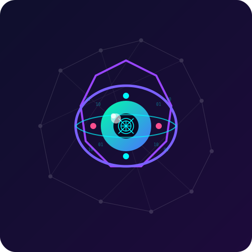

# VisionX

<div align="center">
  
</div>

VisionX is the world's first DeSci platform that funds and supports AI and vision research through blockchain and AI technologies, with a special focus on eye-related technologies. VisionX combines AI visual analysis with blockchain technology to create a seamless bridge between the physical and digital worlds.

**Slogan:** "See the Future, Shape the Web3"

<div align="center">
  
[](https://github.com/Vision-X-AI/visionx)
[](https://github.com/Vision-X-AI/visionx)
[](https://github.com/Vision-X-AI/visionx)
[](https://github.com/Vision-X-AI/visionx)
[](https://github.com/Vision-X-AI/visionx)


[](https://github.com/Vision-X-AI/visionx/stargazers)
[](https://github.com/Vision-X-AI/visionx/issues)

</div>

## Core Features

- **AI Visual Analysis Engine (VisionCore)**: Real-time visual parsing, blockchain data mapping, and personalized predictions
- **Decentralized Visual Storage & Computation**: IPFS/Arweave integration with edge computing capabilities
- **Metaverse & NFT Integration**: Dynamic NFT generation and immersive virtual experiences
- **Web3 Native Interface**: Mobile-first DApp with AR support

## Technical Stack

- **Frontend**: Next.js, React, TailwindCSS
- **AI/ML**: TensorFlow.js for client-side visual analysis
- **Blockchain**: Multi-chain support (Ethereum, BSC, Solana)
- **Storage**: IPFS, Arweave

## Technical Architecture

VisionX follows a modular, scalable architecture designed to seamlessly integrate AI visual processing with blockchain technologies:

```
┌─────────────────────────────────────────────────────────────────┐
│                     Client Application Layer                     │
│  ┌───────────────┐  ┌───────────────┐  ┌───────────────────┐    │
│  │ React UI/UX   │  │ Next.js SSR   │  │ Web3 Connection   │    │
│  └───────────────┘  └───────────────┘  └───────────────────┘    │
└─────────────────────────────────────────────────────────────────┘
                            ▲                  ▲
                            │                  │
                            ▼                  ▼
┌─────────────────────────────┐      ┌────────────────────────────┐
│   AI Processing Layer       │      │   Blockchain Layer         │
│  ┌─────────────────────┐   │      │  ┌────────────────────┐    │
│  │ Visual Analysis     │   │      │  │ Smart Contracts    │    │
│  │ ┌─────────────────┐ │   │      │  │ ┌────────────────┐ │    │
│  │ │ Image Recognition│ │   │      │  │ │NFT Marketplace │ │    │
│  │ └─────────────────┘ │   │      │  │ └────────────────┘ │    │
│  │ ┌─────────────────┐ │   │      │  │ ┌────────────────┐ │    │
│  │ │Pattern Detection│ │   │◄────►│  │ │Token Economics │ │    │
│  │ └─────────────────┘ │   │      │  │ └────────────────┘ │    │
│  └─────────────────────┘   │      │  └────────────────────┘    │
└─────────────────────────────┘      └────────────────────────────┘
                 ▲                                  ▲
                 │                                  │
                 ▼                                  ▼
┌────────────────────────────────────────────────────────────────┐
│                     Decentralized Storage Layer                 │
│  ┌────────────────────────┐      ┌───────────────────────────┐ │
│  │         IPFS           │      │         Arweave           │ │
│  └────────────────────────┘      └───────────────────────────┘ │
└────────────────────────────────────────────────────────────────┘
```

### Key Components:

1. **Client Application Layer**: Handles user interface, server-side rendering, and Web3 wallet connections
2. **AI Processing Layer**: Processes visual data using advanced AI algorithms
3. **Blockchain Layer**: Manages smart contracts, NFT operations, and token economics
4. **Decentralized Storage Layer**: Stores visual data permanently and securely

## Functional Module Flow Chart

```
┌────────────────┐     ┌───────────────┐     ┌────────────────────┐
│                │     │               │     │                    │
│  Image Upload  │────►│ AI Processing │────►│   NFT Generation   │
│                │     │               │     │                    │
└────────────────┘     └───────────────┘     └────────────────────┘
                              │                         │
                              ▼                         ▼
                      ┌───────────────┐      ┌────────────────────┐
                      │               │      │                    │
                      │ Data Analysis │      │ Marketplace Listing│
                      │               │      │                    │
                      └───────────────┘      └────────────────────┘
                              │                         │
                              ▼                         ▼
                      ┌───────────────┐      ┌────────────────────┐
                      │               │      │                    │
                      │ Personalized  │      │  Token Rewards     │
                      │ Insights      │      │                    │
                      └───────────────┘      └────────────────────┘
                              │                         │
                              └─────────────┬───────────┘
                                            │
                                            ▼
                                  ┌────────────────────┐
                                  │                    │
                                  │ Metaverse Display  │
                                  │                    │
                                  └────────────────────┘
```

### Process Flow:

1. Users upload visual content to the platform
2. AI processing engine analyzes the visual data
3. Based on analysis, users can generate NFTs or receive personalized insights
4. NFTs can be listed on the marketplace for trading
5. Users earn token rewards for platform participation
6. Visual assets can be displayed in metaverse environments

## Project Highlights

- **AI-First Approach**: Unlike typical Web3 projects, VisionX places AI visual analysis at the core of its functionality
- **Cross-Chain Compatibility**: Built from the ground up to work seamlessly across multiple blockchains
- **Edge Computing**: Reduces latency by processing visual data at the edge when possible
- **Privacy-Preserving**: Uses zero-knowledge proofs for sensitive visual analysis operations
- **Community Governance**: DAO structure allows token holders to influence platform development
- **Scalable Architecture**: Designed to handle millions of daily visual processing requests
- **Immutable Visual History**: All processed visual data maintains a verifiable on-chain history
- **Developer-Friendly**: Open API for third-party developers to build visual-based dApps

## Project Roadmap

### Phase 1: Foundation (Q1 2025)
- ✅ Core platform architecture design
- ✅ AI visual analysis engine prototype
- ✅ Smart contract development
- ✅ Frontend MVP development

### Phase 2: Beta Launch (Q2-Q3 2025)
- ✅ Testnet deployment
- ✅ Beta user testing and feedback collection
- ✅ Community building and initial partnerships

### Phase 3: Mainnet Launch (Q4 2025)
- ⬜ Platform mainnet launch
- ⬜ NFT marketplace opening
- ⬜ Token Generation Event
- ⬜ Major exchange listings

### Phase 4: Expansion (Q1-Q2 2026)
- ⬜ Metaverse integration
- ⬜ Advanced AI features release
- ⬜ Mobile app launch
- ⬜ Enterprise partnerships

### Phase 5: Ecosystem Growth (Q3-Q4 2026)
- ⬜ Developer SDK release
- ⬜ Cross-chain expansion
- ⬜ DAO governance implementation
- ⬜ Grants program for ecosystem projects

## Getting Started

### Prerequisites

- Node.js (v16+)
- npm or yarn
- MetaMask or other Web3 wallet

### Installation

1. Clone the repository:
   ```
   git clone https://github.com/yourusername/visionx.git
   cd visionx
   ```

2. Install dependencies:
   ```
   npm install
   # or
   yarn install
   ```

3. Run the development server:
   ```
   npm run dev
   # or
   yarn dev
   ```

4. Open [http://localhost:3000](http://localhost:3000) in your browser.

## Token Economics

VisionX features the $VIX token which serves as the platform's utility token:

- Payment for NFT minting and metaverse subscriptions
- Staking for "Vision Points" and governance rights
- VisionX Binding Tokens (VIX) - unique visual-bound digital assets

## FAQ

### What makes VisionX different from other DeSci platforms?
VisionX goes beyond simple DeSci platforms. Our platform analyzes visual content for patterns, relevance, and potential applications across Web3,  by incorporating advanced AI visual analysis to add real utility and value to digital assets.

### How does the AI visual analysis work?
Our proprietary AI engine processes images using multiple neural networks trained on both traditional visual datasets and blockchain-specific data. This allows for unique features like rarity prediction, visual trend analysis, and content authentication.

### Do I need technical knowledge to use VisionX?
No. VisionX is designed with a user-friendly interface that abstracts the technical complexity. Users can upload images, receive analysis, create NFTs, and participate in the ecosystem without blockchain or AI expertise.

### How are transaction fees handled?
VisionX operates on a hybrid fee model. Basic operations use layer-2 solutions for minimal gas fees, while premium features require $VIX tokens. A portion of all fees is redistributed to platform stakers.

### Is VisionX compatible with all blockchains?
We're launching with support for Ethereum, BSC, and Solana, with plans to expand to additional chains based on community demand and technical feasibility.

### How can developers build on VisionX?
We offer an open API and SDK (coming in Phase 5) that allows developers to integrate VisionX's visual analysis capabilities into their own applications. Our documentation provides comprehensive guides for building on our platform.

## Contributing

Contributions are welcome! Please feel free to submit a Pull Request.

## License

This project is licensed under the MIT License - see the LICENSE file for details.

## Contact

- Website: [vision-x.xyz](https://www.vision-x.xyz/)
- Twitter: [@VisonX_Official](https://x.com/VisonX_Official)
